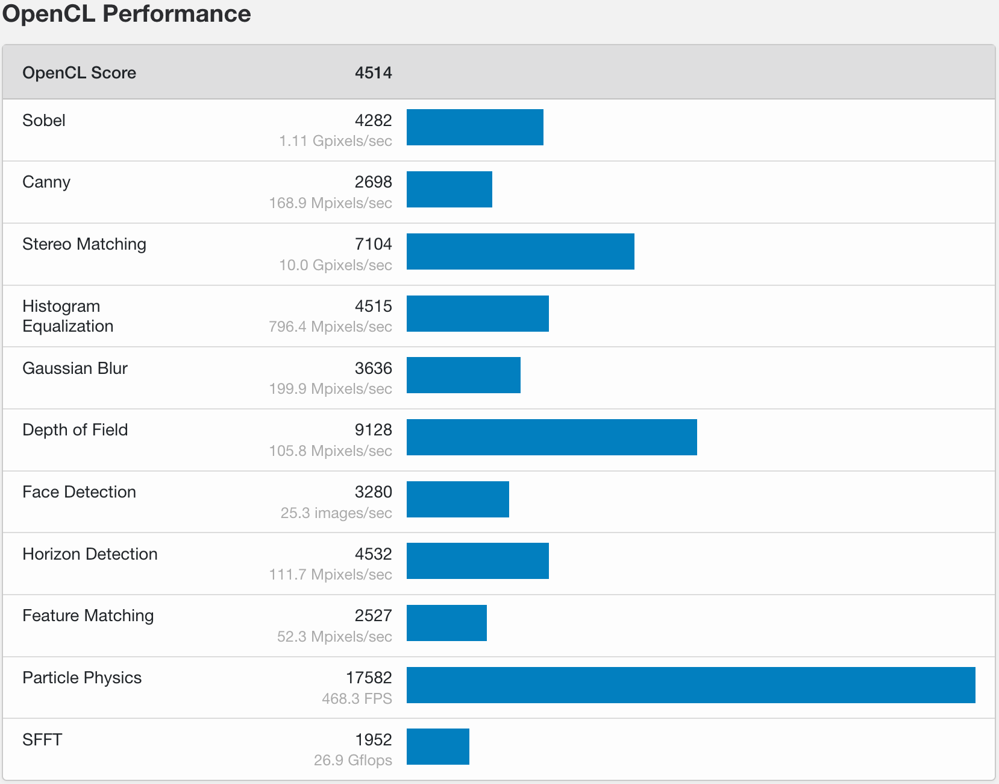
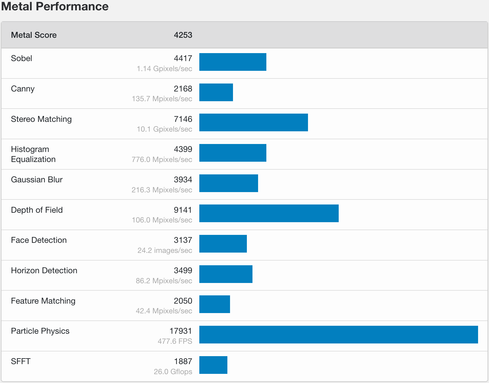
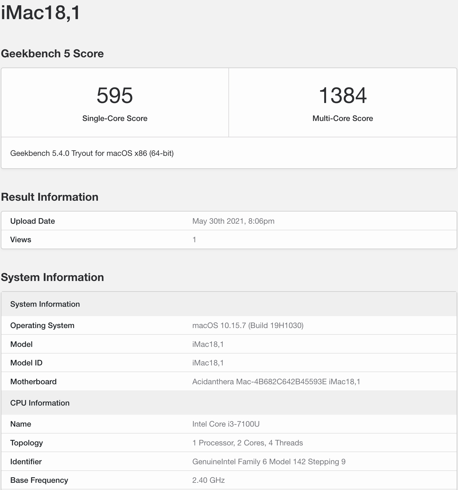

# macOS  on Intel NUC7i3BNH
<p align="center">

</p>
<p align="center">
<a href="https://downloadcenter.intel.com/it/product/95066/Kit-Intel-NUC-NUC7i3BNH" target="_blank"></a>
<a href="LICENSE" target="_blank"></a>
<a href="https://github.com/profzei/NUC7i3BNH/releases" target="_blank"></a>
<a href="https://github.com/profzei/NUC7i3BNH/wiki" target="_blank"></a>
</p>


#### This repo is currently compatible with macOS Catalina and OpenCore 0.7.3

This repo contains information for getting macOS working on an **Intel NUC7i3BNH**.

This EFI is built and tested on **Catalina 10.15.7**: for the moment I stick with Catalina (Supplemental + Security Update - Build 19H1323) since I need a machine as stable and reliable as possible as a daily driver. However Big Sur compatibility should be fine (but untested).

**This repository is for personal purposes**

<p align="center">

</p>

### DISCLAIMER

- Read the entire README before you start.
- I am not responsible for any damages you may cause.
- Should you find an error or improve anything — whether in the config or in the documentation — please consider opening an issue or pull request.
- **Complete EFI packs** are available in the [**Releases**](https://github.com/profzei/NUC7i3BNH/releases) page (please, refer to the rightside menu).
- Please **do not clone or download** the main branch for daily use: it may include **unstable code** just because it is my repository.

If you find this bootloader configuration useful, consider **giving** it **a star** to make it more visible.

If you find my work useful, please consider **donating via PayPal**. [](https://www.paypal.com/cgi-bin/webscr?cmd=_donations&business=TSJHK3C2BSQN6&currency_code=EUR)

## Overview

What is an **Intel NUC**? It is a tiny barebone PC size of a few CD cases piled on top of each other.

Mine is **NUC7i3BNH** which is the Core i3 model with a 2.5'' slot for an additional SATA drive coupled with a **BenQ PD2500Q** which is a **2k 25" calibrated monitor**.

### Specifications

| NUC Components       | Details                                                         |
| :--- | :--- |
| Computer model       | Intel NUC7i3BNH                                                 |
| Processor            | Intel Core i3-7100U Processor @ 2.4 GHz dual core with 15 W TDP |
| Memory               | 16 GB DDR4-2133 SO-DIMM @ 1.2 V                                 |
| M.2 SSD Card         | Lexar Professional NM700 PCIe NVMe 256 GB [LNM700-25RB]         |
| SATA SSD 2.5" Drive  | Crucial M500 240 GB [CT240M500SSD1]                             |
| Integrated Graphics  | Intel(R) HD Graphics 620 GPU                                    |
| Sound Card           | Realtek ALC283                                                  |
| LAN Adapter          | Intel Gigabit Ethernet I219 V4
| Wireless Card        | Intel Wireless-AC 8265 (802.11ac, dual-band, max. 867 Mbps)     |
| Bluetooth Card       | Intel Bluetooth 8265 (v. 4.2)                                   |
| **Other Components** |  |
| Monitor              | BenQ PD2500Q 2k Display @ 2560 x 1440 (25" @ 16:9)              |
| Keyboard             | HP Keyboard K1500                                               |
| Mouse                | Apple Magic Mouse 2                                             |

Other hardware specifications:
- Four USB 3.0 ports (2 on the front, 2 on the rear)
- One USB type-C Port (which offers USB 3.1 gen2) with DisplayPort 1.2 functionality
- One normal full-size HDMI 2.0a port
- Micro SD card reader (support SDXC cards and UHS-I)
- Dual-array microphones on the front panel
- Infrared sensor and 3.5 mm audio jack

**Note**: NUC7i3BNH (i.e. the i3 model for NUC7) does not support ThunderBolt over the Type-C connector, unlike the more expensive models in the lineup.

**Device Firmware** BIOS version: `BNKBL357`

<details>
<summary><strong>Benchmarks</strong></summary>

|   |  |
|:---:|:---:|
| **GPU** - **OpenCL** Performance **4514** | **GPU** - **Metal** Performance **4253** |

<p align="center">

</p>

|  |
| :---:|
| **Single-Core** Score **595** ~~~~~~~~~~~~~~~~~~~~~~ **Multi-Core** Score **1384** |


</details>

## BIOS Settings

 Update to the [latest BIOS version](https://downloadcenter.intel.com/it/product/95066/Kit-Intel-NUC-NUC7i3BNH), then load BIOS **Defaults** and finally in the **Advanced** submenu change the following settings:
- `Devices -> USB -> Port Device Charging Mode: Off`
- `Devices -> USB -> USB Legacy -> Disabled`
- `Power -> Wake on LAN from S4/S5: Stay Off`
- `Boot -> Boot Configuration -> Network Boot: Disable`
- `Boot -> Secure Boot -> Disable`

### Generate your own SMBIOS Information

For privacy reasons, all SMBIOS information has been wiped out in the configuration file `EFI/OC/config.plist`.
- You need to generate your unique `SMBIOS` info by yourself (recommend to use [**CorpNewt's GenSMBIOS**](https://github.com/corpnewt/GenSMBIOS)), and inject them into your `config.plist`.

**For dual-booting systems, Windows Activation may fail due to different hardware UUID generated by OpenCore**
- According to [OpenCore Official Configuration](https://github.com/acidanthera/OpenCorePkg/blob/master/Docs/Configuration.pdf), you are highly recommended to inject the **original Windows system UUID** to `PlatformInfo -> Generic - >SystemUUID` in `EFI/OC/config.plist`: run `wmic csproduct get UUID` command in Windows PowerShell app

## Changelog

#### 2021 - September - 10
See [**Current status**](Changelog.md)

## Status
WIP...

## USB Port Mapping on NUC chassis

<p align="center">

</p>

The **active and working USB ports are listed** in the following table, while **all unused or non-referenced USB ports are accordingly removed**:

| USB 2.0 Port Name | USB 3.0 Port Name | Hardware Location       | Controller     |
| ----------------- | ----------------- | ----------------------- | -------------- |
| HS01              | SS01              | Front RIGHT socket      | Primary XHCI   |
| HS02              | SS02              | Front LEFT socket       | Primary XHCI   |
| HS03              | SS03              | Rear BOTTOM socket      | Primary XHCI   |
| HS04              | SS04              | Rear TOP socket         | Primary XHCI   |
| HS08              | n/a               | Internal Bluetooth port | Primary XHCI   |
| n/a               | SS01              | Rear USB-C socket       | Secondary XHCI |

- Primary `XHCI`: `8086:9f2f`
- Secondary `XHCI`: `8086:15db`(recognized as a subsystem for Thunderbolt Controller `JHL6340`)

Secondary `XHCI` interface enables the unique **USB type-C Port** (which offers USB 3.1 gen2) with DisplayPort 1.2 functionality present on NUC7i3BNH. Why is this aspect so important for my config?
- Background:
	- a known issue ([Reddit & Mac mini 2020 M1](https://www.reddit.com/r/mac/comments/lc0tvu/mac_mini_m1_2020_and_benq_pd2500q_display/), [Reddit & Mac mini 2018](https://www.reddit.com/r/macmini/comments/gld233/macmini_2020_and_benq_pd2500q_display_vertical/), [MacRumors & Mac mini 2020](https://forums.macrumors.com/threads/mac-mini-2020-benqq-pd2500q-green-line-on-the-side.2236349/)) between my monitor BenQ PD2500Q and Mac is a vertical line on the right side of the display at all resolutions except 1920x1080 HD one;
	- this issue is related to HDMI port used for connecting display to NUC7i3BNH;
	- a such issue is also documented for Mac mini 2018 or 2020 machines using HDMI ports;
- Solution: using a USB type-C (from NUC7i3BNH) to HDMI cable adapter fixes the issue for all BenQ PD2500Q available resolutions even at highest QHD one. 

## Optional Settings
<details>  
<summary><strong>Increase Launchpad icons number</strong></summary>

By default, the **Launchpad** shows the icons in 5×7 format (i.e. rows x columns).

Since BenQ PD2500Q is a 2k 25'' monitor, type in **Terminal** the following commands:
```
defaults write com.apple.dock springboard-rows -int 7
defaults write com.apple.dock springboard-columns -int 10;killall Dock
```
Relaunch the Launchpad to see the icons are changed now.

Finally you can revert to the default setting with the following commands:
```
defaults delete com.apple.dock springboard-rows
defaults delete com.apple.dock springboard-columns
defaults write com.apple.dock ResetLaunchPad -bool TRUE;killall Dock
```
(**Warning**: the last command also will remove any custom folders you have created)
</details>

<details>  
<summary><strong>Make macOS zsh Terminal colorful</strong></summary>

The **default macOS Terminal** looks very lame since it lacks in visibility: things should be colorful like Ubuntu. 
In the following steps, a proper solution for that is given **without installing any custom theme**:
- Choose any black theme first as the color combination of my snippet is dark theme friendly
- Open **Terminal** and type:
```
cd
touch zshrc
open zshrc
```
- Append the following code in the file:
```
export CLICOLOR=1
export LSCOLORS=GxBxCxDxCxegedabagaced
```
- Save the file and quit your default editor
- In **Terminal** type:
```
mv zshrc .zshrc
```
- Quit **Terminal** (`cmd + q`)
- Now open a new **Terminal** window and the changes will be reflected

#### How did the customization worked?

By setting `CLICOLOR=1` you are enabling colors.

`LSCOLORS` is the variable where you will define which file should display what color: it is used to color the directory and file list. 
It provides you 11 positions, each with `FB` (foregroundColor backgroundColor) combination. Thus it contains 22 characters. Below is the details of which position means what:
1. directory
2. symbolic link
3. socket
4. pipe
5. executable
6. block special
7. character special
8. executable with setuid bit set
9. executable with setgid bit set
10. directory writable to others, with sticky bit
11. directory writable to others, without sticky

The colors for each position are placed as `FB` format; below is the list which color means what:
- `a`: black
- `b`: red
- `c`: green
- `d`: brown
- `e`: blue
- `f`: magenta
- `g`: cyan
- `h`: light grey
- `A`: bold black, usually shows up as dark grey
- `B`: bold red
- `C`: bold green
- `D`: bold brown, usually shows up as yellow
- `E`: bold blue
- `F`: bold magenta
- `G`: bold cyan
- `H`: bold light grey; looks like bright white
- `x`: default foreground or background

The colors mentioned above are ANSI colors, but according to the version of your macOS or terminal, they may differ a little.
</details>

<details>  
<summary><strong>Dual Booting: fix Windows time</strong></summary>

Windows uses local time by default while macOS uses universal time. You can switch Windows 
to use universal time.
Open up a command prompt in Windows as an administrator and copy and paste this in:
```
reg add "HKEY_LOCAL_MACHINE\System\CurrentControlSet\Control\TimeZoneInformation" /v RealTimeIsUniversal /d 1 /t REG_QWORD /f
```
That will make Windows use universal time instead of local time.
Then update your clock via the built-in internet time setting to update the time.
</details>

## Update tracker

| Item | Version | Remark |
| :--- | :--- | :--- |
| MacOS | 10.5.7 | |
| [OpenCore](https://github.com/acidanthera/OpenCorePkg/releases) | 0.7.3 | Default Bootloader|
| [Lilu](https://github.com/acidanthera/Lilu/releases) | 1.5.6 | Kext/process/framework/library patcher |
| [WhateverGreen](https://github.com/acidanthera/whatevergreen/releases) | 1.5.3 | Handle Graphics card |
| [AppleALC](https://github.com/acidanthera/AppleALC/releases) | 1.6.4 | Handle/fix onboard audio |
| [CPUFriend](https://github.com/acidanthera/CPUFriend/releases) | 1.2.3 | Power management |
| [HibernationFixup](https://github.com/acidanthera/HibernationFixup/releases) | 1.4.3 | Handle hibernate status |
| [IntelBluetoothFirmware](https://github.com/OpenIntelWireless/IntelBluetoothFirmware/releases) | 2.0.0 beta | Handle Bluetooth |
| [AirportItlwm](https://github.com/OpenIntelWireless/itlwm/releases) | 2.1.0 beta | Handle native Wi-Fi card |
| [IntelMausi](https://github.com/acidanthera/IntelMausi/releases) | 1.0.6 | Handle native Ethernet LAN card |
| [NVMeFix](https://github.com/acidanthera/NVMeFix/releases) | 1.0.7 | Fix for NVMe SSDs |
| [RestrictEvents](https://github.com/acidanthera/RestrictEvents/releases) | 1.0.4 | Block unwanted processes |
| [VirtualSMC + plugins](https://github.com/acidanthera/VirtualSMC/releases) | 1.2.7 | SMC chip emulation |
| [Sinetek-rtsx](https://github.com/cholonam/Sinetek-rtsx/releases) | 9.0 | Micro SD card reader driver |
| [USBInjectAll](https://github.com/daliansky/OS-X-USB-Inject-All/releases) | 0.7.7 | Inject USB ports |
| [VoltageShift](https://github.com/sicreative/VoltageShift) | 1.25 | Undervoltage tool |

## Credits
Standing on the shoulders of giants! Based on the works of many great people.
- [Acidanthera](https://github.com/acidanthera)
- [Dortania's OC guide](https://dortania.github.io/OpenCore-Install-Guide/)
- [Rehabman's ACPI hotpatching guide](https://www.tonymacx86.com/threads/guide-using-clover-to-hotpatch-acpi.200137/)
- [CorpNewt's tools](https://github.com/corpnewt)
- [OpenWireless project](https://github.com/OpenIntelWireless/itlwm)
- [Daliansky's OC-little repo](https://github.com/daliansky/OC-little)
- [Khronokernel's DarwinDumped repo](https://github.com/khronokernel/DarwinDumped)

And to everyone else who supports and uses my repo.